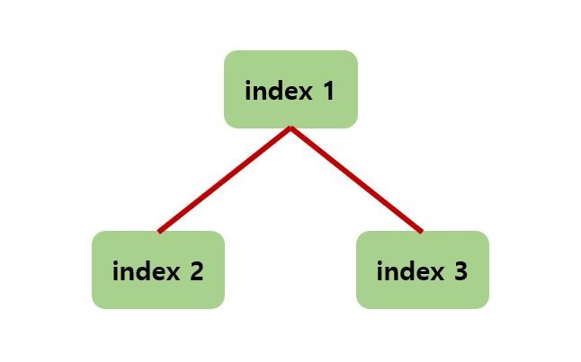

## 힙(Heap) 자료구조 요약정리

힙은 완전 이진트리의 자료 구조이다. 완전히 정렬된 상태가 아닌 반 정렬 상태이며 완전 이진트리와는 다르게 중복값이 허용된다. 트리는 복잡도가 O(logN) 이므로 삽입,삭제가 빠르다. 

### 힙 구현하기
- 보통 우선순위 큐로 힙을 구현한다.(빼열, 리스트보다 효율적)
- 최대힙, 최소힙 두 가지로 나뉘어진다.
    - 최대힙: 부모노드의 값이 가장 크다
    - 최소힙: 부모노드의 값이 가장 작다
- 최소값이나 최대값을 빨리 찾아야 할 때 유용하다.
- 배열로 구현할때 인덱스 0은 사용하지 않는다. 

- 왼쪽자식은 부모 인덱스x2, 오른쪽 자식은 부모인덱스x2+1 
- 자식노드(N)의 부모노드는 N/2로 표현한다.

### 최소힙 소스 코드
- 배열리스트로 구현한 최소힙
	- 
- 출력 결과 구조

### 탐욕법을 활용한 문제
- [더맵게](https://github.com/TheCopiens/algorithm-study/blob/master/source/ohhako/200312_heap.md)

---
아래의 사이트를 참고해 작성된 글입니다.
- https://hannom.tistory.com/36
- 