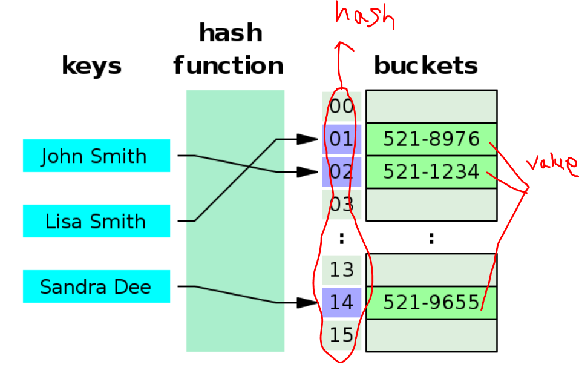

# Hashing
### 요약 설명 
해싱은 대량의 데이터에 주소를 부여하여 key와 value를 테이블에 대응(mapping)시키는 데이터 관리 기법입니다.

### 해시테이블(hash table)

출처:위키백과-해시테이블

* 해시테이블은 key-value 쌍으로 데이터를 저장하는 자료구조입니다. value 값을 찾고자 할때 지정된 key를 이용합니다.
* 구성요소: 키(key), 해시함수(hash function), 해시(hash), 값(value), 저장소(Bucket,slot)
    * 키: 테이블의 key를 구분하는 고유값으로 동일한 key는 존재하지 않는다. key가 해시함수에서 입력값이 되어 해시함수의 값 해시를 결정한다. 가끔 서로다른 키가 같은 해시값을 같게 되는 경우가 있는데 이 현상을 '충돌'이라고 한다. 해시 충돌을 일으키는 확률이 적어야 하며 이 확률은 해시함수의 성능을 결정한다.
    * 해시함수: key를 입력받아 연산처리하여 해시(hash)를 만든다. key에 따라서 데이터가 테이블 어느 영역에 위치해야 할지 결정해준다.
    * 해시: 해시함수의 결과값으로 저장소(bucket,slot)에서 값과 매칭되어 저장된다. 
    * 값: 저장소(bucket,slot)에 최종적으로 저장되는 값이다. key와 매칭되어 저장,삭제,검색,접근이 가능해야 한다.

## 해시 문제 풀어보기
https://programmers.co.kr/learn/courses/30/parts/12077
https://www.acmicpc.net/problem/tag/%ED%95%B4%EC%8B%B1

---
본 글은 아래의 사이트를 참고해 작성되었습니다.
- https://omnis.tistory.com/entry/Hashing-%EC%9D%B4%EB%9E%80
- https://velog.io/@cyranocoding/Hash-Hashing-Hash-Table%ED%95%B4%EC%8B%9C-%ED%95%B4%EC%8B%B1-%ED%95%B4%EC%8B%9C%ED%85%8C%EC%9D%B4%EB%B8%94-%EC%9E%90%EB%A3%8C%EA%B5%AC%EC%A1%B0%EC%9D%98-%EC%9D%B4%ED%95%B4-6ijyonph6o
- https://mattlee.tistory.com/62
