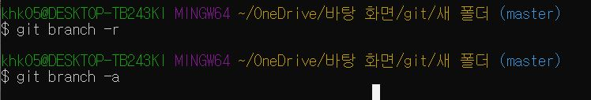
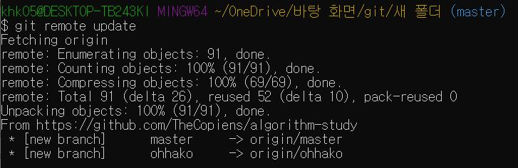
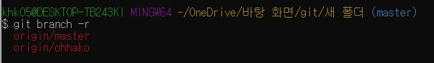
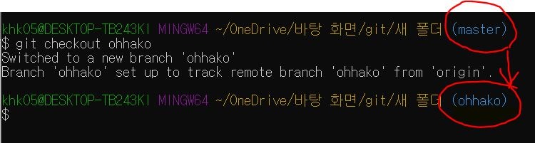

# GitBash를 이용해 깃허브 원격 저장소 브랜치 가져오는 방법 
### 작업 설명
원격 저장소에서 작업중이던 branch를 내 노트북의 작업폴더로 가져오는 작업입니다. 같은 노트북 내에서 작업폴더의 위치를 이동시키는건 **.git**을 포함하는 상위폴더를 사용자가 원하는 위치로 **CTR+C/CTR+V** 또는 **드래그** 하면 됩니다. 그러나 사용자가 실수로 작업폴더를 지웠을 경우에는 master, branch 작업을 원격저장소에서 가져와야 자신의 원격저장소와 GitBash 사이의 **연동 작업**이 가능합니다.

### 원격저장소 브랜치 가져와 설정하는 순서

#### 요약 설명
1. <code> $git init </code> : 브랜치 가져올 작업폴더 선언
2. <code> $git remote add origin URL주소 </code> : 작업폴더에 원격저장소 추가
    - <code> $git remote -v </code> : 작업폴더에 원격저장소 올바르게 추가되었는지 확인
3. <code> $git branch -r </code> : 원격저장소의 브랜치 가져와졌는지 확인 - 결과 안떠야 정상
    - <code> $git branch </code>
    - <code> $git branch -a </code>
4. <code> $git remote update </code> : 작업폴더에 원격저장소 업데이트 - 이때 브랜치 가져와짐
5. <code> $git branch -r </code> : 작업폴더에 원격저장소 잘 가져왔는지 확인
6. <code> $git checkout 브랜치이름 </code> : 작업폴더에서 master에서 자기브랜치로 전환

#### 상세 설명
1. 먼저 원하는 폴더에서 **작업폴더(working directory)** 사용을 선언한다
    - 폴더명 '새폴더'를 원격저장소의 브랜치를 가져올 작업폴더로 만들기 위함이다
    - 새폴더에서 GitBash를 연다        
    - 아래 사진에서 폴더명 오른쪽에 파란글씨의 **master** 표시 확인
    - GitBash에 <code> **$git init**</code> 명령어 입력
    - **명령어 결과** 
    -  
    - 새 폴더에 .git 파일이 생성되었다.

 

2. 작업폴더에 깃허브 **원격저장소** 를 추가한다
    - 사용자가 가져오고싶은 깃허브 원격저장소 페이지에 들어간다
    - 페이지 오른쪽에 있는 초록색 버튼의 **clone or download**를 누른다
    - Clone with HTTPS 표시가 있는 박스에서 URL 복사
    - 이 URL은 원격저장소의 주소
    - GitBash에 <code>**$git remote add origin URL주소** </code> 입력
    - 새폴더에 원격저장소에 있는 파일이 복사된것 확인
    - <code>$git remote -v</code> 명령어로 작업폴더와 원격저장소 잘 연결되었는지 확인
    - **명령어 결과**
    -  
 

3. 작업폴더에 가져온 브랜치를 확인한다
    - 로컬저장소 브랜치 목록확인 <code> **$git branch** </code>
    - 원격저장소 브랜치 목록확인 <code> **$git branch -r** </code>
    - 모든 브랜치 목록확인 <code> **$git branch -a** </code>
    - **명령어 결과**
    -  
    - **아무것도 안뜨는게 당연하다**
 

4. 작업폴더에 원격저장소를 업데이트 시킨다
    - 업데이트 명령어 <code> **$git remote update** </code>
    - **명령어 결과**
    -  
    - 이제 branch목록을 확인해보자 
 

5. 작업폴더에 가져온 브랜치를 확인한다
    - 원격저장소 브랜치 목록확인 <code> **$git branch -r** </code>
    - **명령어 결과**
    -  
    - 원격저장소의 브랜치를 가져온 것을 확인할 수 있다.
 

6. 작업폴더에서 브랜치를 전환한다
    - 브랜치 전환 명령어 <code> **$git checkout 브랜치이름** </code>
    - **명령어 결과**
    -  
    - 줄곧 master로 표시되던게 브랜치이름으로 변경된것을 확인한다
    - 이제 설정된 branch에서 자유로이 작업할 수 있다. 
    - 다시 master로 돌아가려면 <code> **git checkout master** </code>

 

    

---
### 이 글은 아래 사이트를 참고해 작성되었습니다.
- https://blog.naver.com/dpfdkdlqmdl/221749773809
- https://wonjerry.tistory.com/6
- https://cjh5414.github.io/get-git-remote-branch/
- https://mu-storage.tistory.com/33
