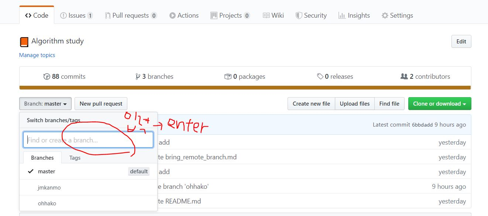

# 원격저장소의 브랜치를 생성하는 방법
### 작업 설명
원격저장소의 브랜치를 이용하면 팀원들과의 공동 작업물과 개인의 작업물을 효율적으로 병합시킬 수 있다. 브랜치를 이용하기에 앞서 원격 저장소의 브랜치를 생성한다. **깃허브 웹**을 이용하는 방법 / **GitBash**를 이용하는 방법 두가지가 있으며 사용자의 상황에 따라서 선택해 사용한다.

 

## 깃허브 웹에서 브랜치(branch) 만드는 방법
   
1. 원하는 저장소에 들어가기
2. 메뉴 왼쪽 하단에 보면 셀렉박스로 branch master라고 써있는 버튼 확인
3. 버튼 클릭 시 현재 원격저장소가 갖고있는 브랜치 목록이 뜬다. 
4. 텍스트박스를 클릭해 브랜치이름을 입력한다. 
5. Enter 치면 branch 생성 완료
6. 위 5개의 메뉴에서 commits 오른쪽에 있는 branches를 클릭하면 생성된 브랜치를 확인할 수 있다.

참고로 웹에서 생성한 브랜치를 노트북으로 가져오는 작업은 아래 링크를 따라 시행한다.
- [GitBash를 이용해 깃허브 원격 저장소 브랜치 가져오는 방법](https://github.com/TheCopiens/algorithm-study/blob/master/docs/github/bring_remote_branch.md#gitbash%EB%A5%BC-%EC%9D%B4%EC%9A%A9%ED%95%B4-%EA%B9%83%ED%97%88%EB%B8%8C-%EC%9B%90%EA%B2%A9-%EC%A0%80%EC%9E%A5%EC%86%8C-%EB%B8%8C%EB%9E%9C%EC%B9%98-%EA%B0%80%EC%A0%B8%EC%98%A4%EB%8A%94-%EB%B0%A9%EB%B2%95)

## GitBash 이용해 브랜치(branch) 만드는 방법

1. 작업폴더에서 GitBash 오픈 (Windows경우 파란색 글씨의 master표시 확인)
2. <code> git branch 브랜치이름 </code>
    - 브랜치 생성
3. <code> git checkout 브랜치이름 </code>
    - 생성한 브랜치로 전환
    - 2번의 브랜치이름과 동일해야 한다.

4. <code> git push origin 브랜치이름 </code>
    - 원격 저장소에 반영하기
    - 2,3의 브랜치이름과 동일해야 한다.

참고로 1,2번의 작업을 동시에 진행하는 명령어는 아래와 같다.  
<code> git checkout -b 브랜치이름 </code>     
브랜치를 생성했으니 이제 작업 후 원격 저장소에 반영하는 작업은 아래 링크를 따라 진행한다.

- [GitBash 명령어 사용 방법](https://github.com/TheCopiens/algorithm-study#gitbash-%EB%AA%85%EB%A0%B9%EC%96%B4-%EC%82%AC%EC%9A%A9-%EB%B0%A9%EB%B2%95)