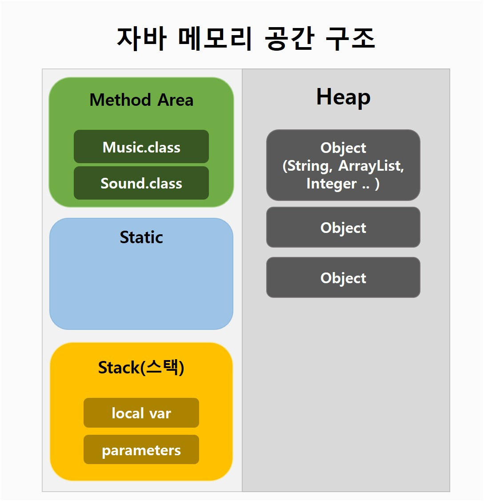

# String, StringBuffer, StringBuilder 비교하기
String, StringBuffer, StringBuilder 는 모두 String 문자열을 저장하고 관리하는 클래스 입니다. 쓰임새에 따라 String 클래스를 선택해서 사용 할 수 있으며 어떤 상황에서 어떤 String클래스를 이용하면 좋을지 알아보겠습니다.

### 차이점 요악 설명
- String은 불변(immutable) 속성이다
- StringBuffer는 가변(mutable) 속성이다
- 짧은 문자열을 더하는 경우엔 String 사용
- 스레드에 안전한 프로그램 개발 시 StringBuffer 사용 
- 스레드 안전여부가 관계 없을 시 StringBuilder 사용
- 연산이 많아지는 경우 StringBuilder > StringBuffer >>> String

### 자바 메모리 공간 구조
 
<small>출처:ohhako</small>

### String 클래스
- String 객체가 한번 생성되면 **할당된 메모리 공간**은 **변하지 않는다.**
- concat이나 더하기 연산 이용시 새로운 객체를 생성해 그 객체를 참조한다.
    - 즉 한번 생성된 객체의 내용은 변하지 않음
    - 참조 객체가 변경되는 것
    - 참조되지 않는 객체는 가비지컬렉터로부터 수거됨
- 새 객체는 Heap영역에 생성된다.
- 새 객체 참조방식 때문에 Heap에 데이터가 쌓이면 문자열이 많은 경우 메모리 부족으로 속도가 느려진다.

### StringBuffer 클래스, StringBuilder 클래스
#### 공통점
- 문자열 연산, 추가시에 기존 버퍼의 크기를 늘려준다.
- 따라서 String보다 동작 방식이 유연하다.
- Buffer, Builder가 제공하는 메서드는 동일하다.
#### 차이점 
- StringBuffer는 각 메서드마다 Synchronized Keyword가 존재한다.
- 멀티스레드 환경에서 사용하기 좋다.
    - 동기화 지원
- Builder는 싱글스레드 환경에서 사용하기 좋다.
    - 동기화를 지원하되 보장하지 않음

---
본 글은 아래의 사이트를 참고해 작성되었습니다.
- https://yaboong.github.io/java/2018/05/26/java-memory-management/
- https://dsnight.tistory.com/50
- https://coding-factory.tistory.com/127
- https://12bme.tistory.com/42
- https://zzdd1558.tistory.com/144