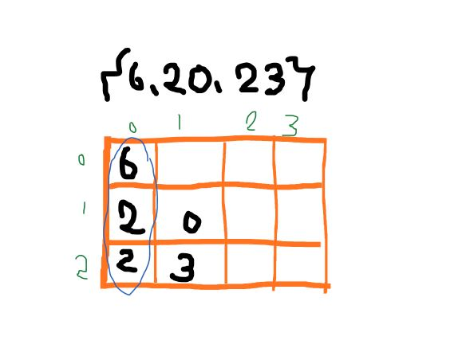

# 프로그래머스 정렬 문제 
- K번째수
    - https://programmers.co.kr/learn/courses/30/lessons/42748?language=java
- 가장 큰 수
	- https://programmers.co.kr/learn/courses/30/lessons/42746?language=java
		
## K번째 수
### 내가 고안한 방법
 문제의 난이도는 어렵지 않으나 이 두개의 메서드를 모르고 있다면 코드가 필연적으로 길어진다. 메서드를 이미 알고있다면 문제를 보자마자 푸는 방법이 직관적으로 떠올라야 한다. 먼저 주어진 조건에서 문제 푸는 순서를 뽑아보자.
#### 사용한 메서드
1. 복사 메서드 <code>**copyOf()</code>/<code>copyOfRange**</code>
2. 정렬 메서드 <code>**sort()**</code>
#### 문제를 풀어낸 순서
- 주어지는 인자 **array**, **commands** 가 무엇인지 **의미**와 **용도**를 파악
- array를 정렬해야하는데 commands의 길이와 동일한 횟수만큼 **서로 배열이 다른 정렬**을 시행해야 해야하므로 **배열 복사**가 필요하다.
- 정렬해야하는 array의 범위가 주어지며 commands에서 **범위를 추출**한다.
- 정렬 된 배열에서 **n번째 인자**를 추출해야 하며 n 또한 **commands**에서 추출한다. 
- 추출한 인자를 배열 **answer**에 넣는다.

주의할 점은 **commands&#91;i&#93;&#91;j&#93;** 값의 이용이다. **commands&#91;i&#93;&#91;j&#93;** 값을 배열 index에 **그대로 이용**하면 구하려고 하는 값이 나오지 않는다. 자세한 설명은 사용 메서드를 설명한 후 아래 코드에서 진행하기로 한다.

### copyOf(), copyOfRange(), sort()
- **copyOf(Object[] object,int length)**: 복사하고자 하는 배열, 복사하고자 하는 배열 길이를 인자로 넘겨주면 복사 생성된 배열을 반환해준다. int, char 타입 배열을 인자로 사용할 수 있다. Arrays 클래스의 메서드이므로 호출 시 명시해야 한다.
<code>int[] ar = Arrays.copyOf(array,array.length)</code>

- **copyOfRange(Object[] object,int from,int to)**: 배열하고자 하는 길이를 정하는 copyOf()와 다르게, 이 메서드는 **범위 지정**이 가능하다.
- **Arrays.sort(Object[] a)** : 배열을 오름차순으로 정렬한다.
- **Arrays.sort(Object[] a,int from,int toIndex+1)** : 두번째 인자는 **정렬 시작** 인덱스이고 세번째 인자는 **정렬 끝** 인덱스보다 1가 크게 설정한다. 예를들어 array 배열을 **인덱스 2부터 5까지 오름차순** 정렬한다고 가정하면 **Arrays.sort(array,2,6)** 이 된다.

```java
import java.util.*;
class Solution {
    public int[] solution(int[] array, int[][] commands) {
		  int[] cpArray = {};
	      int[] answer = new int[commands.length];
	      for(int i=0 ; i<commands.length ; i++){
	    	  cpArray = Arrays.copyOf(array,array.length);
	          Arrays.sort(cpArray,commands[i][0]-1,commands[i][1]);
	          answer[i] = cpArray[commands[i][0]+commands[i][2]-2];
	      }
	      return answer;
    }
}
```
<br><br>
## 가장 큰 수
### 내가 고안한 방법
### 첫 번째 방법: 중복없고 순서있는 조합, 순열 만들기 (3C3)
배열의 n개 요소를 서로 다르게 조합하는 순열 문제라고 생각했다. 주어진 배열 numbers에 있는 n개 요소를 서로 다르게 조합해 새로운 배열에 삽입하고 **String**으로 변환해 <code>**sort()**</code> 내림차순을 이용하려고 했다. 이 방식을 사용하려면 **combination 계산**을 알고있어야 했다. <br>
**3C3 = 3!** 이므로 배열을 생성해 길이를 지정했다. 여기까지는 코드로 작성하는데 문제가 없었으나 진짜 문제는 **어떻게 조합하는가** 였다. 솔루션이 점점 복잡해짐과 동시에 비효율적인 방법이라고 판단했다.

### 두 번째 방법: 자릿수를 쪼개서 가장 큰 수 찾기
 <br>
주어진 정수를 한자리 숫자로 모두 쪼개 배열에 넣는다. 10을 쪼갠다고 했을 때 쪼개진 1,0이 10의 것인지 알기위해 **이차원 배열**을 사용한다. 숫자가 주어졌을때 이차원 배열의 구조를 알아보기 위해 위의 그림을 참고한다. array&#91;0&#93;&#91;0&#93;를 비교해 가장 큰 순서대로 array&#91;0&#93;를 다른 배열에 넣는다. 이 방법을 사용하려면 **세 가지 문제**가 발생한다.
1.  이중배열 첫번째 요소를 비교해서 가장 큰것 순서대로 새배열에 넣을 때 위와 같이 첫번째 자리가 같은 경우, 두번째 요소를 비교해야 한다. 두번째도 동일하면 세번째 요소를 비교해야 한다. 
2. 요소들의 **자릿수**가 다를때 크기 비교 후 결과가 보편적이지 않다. **3,30,324**의 경우를 생각해보라
=>안좋은 풀이다.
2. 가장 큰 요소를 골라 새 배열에 넣은 후 다음 큰 요소를 고를 때 중복을 피해야 한다. 즉 중복을 체크할 masking 배열이 필요하다. 

### 세 번째 방법: String으로 변환해 sorting 하기
주어진 배열 요소를 내림차순으로 sorting 해 순서대로 이용하는 방법이다. 첫 번째 방법처럼 직접 조합하는 알고리즘을 생각하지 않아도 되어서 매우 간단하다. 게다가 두 번째 방법의 1번, 3번 문제점을 해결 할 수 있다. 하지만 **2번 문제점**과 동일한 **문제점**이 발생한다. sorting 후에 **결과가 항상 참이 아니다.**

### 인터페이스의 비교 메서드를 오버라이드해서 문제 해결하기
대게 나는 요소들을 경우의 수로 직접 조합해 sort하려 했지만 **직접 조합**은 굳이 필요없었다. sort 메서드도 방법이 되지 못했다. <br>
 **왜? numbers의 각 요소를 서로 비교한 결과가 문제에 대해 매번 참은 아니니까.** 그렇다면 비교의 방법을 바꾸는건 어떨까?<br> 
예시 풀이들을 찾아보면 대부분 sort 인터페이스를 **Override**해서 크기 비교 방법 자체를 바꾼다. <br> 인터페이스를 오버라이드하는건 사실 전체 코드 품질을 위해 지양되어야 한다. 해당 메서드를 사용하는 다른 클래스 혹은 인터페이스의 동작 방식에 영향을 주기 때문이다. 하지만 **해당 문제**만 풀기에는 간단한 방법이니 인터페이스의 메서드를 오버라이드 한다. 단순 a > b 크기비교가 아닌,  a+b > a+c 식의 비교로 변화시키기 위해 **오버라이드**가 이루어져야 한다. 아래는 코드로 적용한 두가지 예제이다.

1. 익명 메서드를 이용해 오버라이드 

- **String.valueOf()**: String클래스의 정적 메서드로, 넘어오는 인자를 String형으로 반환한다. String으로 형변환 하는 방법은 다양하지만 **null 예외**, 빠른 처리 속도의 장점을 갖고있어 편리성이 좋다.
- **sort()**: 두번째 인자에 sort의 규칙을 넘겨줄 수 있다. 해당 코드에서는 익명 메서드로 선언해 넘겨주었다.
- **compareTo()**: 
- **StringBuilder 클래스**: StringBuilder클래스 객체를 sb로 선언해 <code>**append()**</code>를 사용했다.
- **append()**: 문자열을 이어붙일 수 있게 도와주는 메서드이다. 붙이고자 하는 문자열을 인자로 넘겨준다.

```java
import java.util.Arrays;
class Solution {
    public static String solution(int[] numbers) {
        String[] arr = new String[numbers.length];
        for (int i = 0; i < numbers.length; i++)
            arr[i] = String.valueOf(numbers[i]);
        Arrays.sort(arr, (o1, o2) -> (o2 + o1).compareTo(o1 + o2));
        if(arr[0].equals("0")) return "0";

        StringBuilder sb = new StringBuilder();
        for (int i = 0; i < arr.length; i++)
            sb.append(arr[i]);

        return sb.toString();
    }
}
```
2. compare 메서드를 직접 오버라이드
- **String.valueOf()**
- **compare()**: sort메서드에 선언된 메서드로, 해당 문제를 풀기 위해 오버라이드 되어야 할 대상이다.
- **compareTo()**
- **equals()**: 인자의 값, 즉 논리적 동치성을 비교한다. 

```java
class Solution {
    public String solution(int[] numbers) {
        String answer = ""; /*int 배열을 String 배열로 변환*/
        String[] arr = new String[numbers.length];
		
        for (int i = 0; i < numbers.length; i++) {
            arr[i] = (String.valueOf(numbers[i]));
        }
 
        //배열 정렬, 정렬 규칙으로는 2개를 더하여 더 큰 쪽이 우선순위가 있도록 정렬
        Arrays.sort(arr, new Comparator<String>() {
            @Override
            public int compare(String s1, String s2) {
                return (s2+s1).compareTo(s1+s2);
            }
        });
        
        if (arr[0].equals("0")) return "0";	/*0000 처럼 0으로만 구성되어있으면 0 return */
        
        //그 외의 경우 순차적으로 연결하여 answer return
        for (int i = 0; i < arr.length; i++) {
            answer+=arr[i];
        }
        return answer;
    }
}
```


## 참고하는 정렬 메서드
### 정수 정렬 (오름차순) 
```java
String[] array = {"2","34","10"};
Arrays.sort(array); 
```

### 정수 정렬 (내림차순) 
오름차순과 사용 방식이 좀 다르다. 배열을 **int 형** 내림차순 정렬하기 위해서는 배열을 **Integer 형** 으로 선언해야 한다. **오토박싱, 언박싱**이 안되니까 코드를 고쳐주자. 또는 배열을 String으로 선언해도 잘 동작된다. 
```java
String[] array = {"2","34"};
Arrays.sort(array); 
Collections.reverse(Arrays.asList(array));

Integer[] array2 = {"2","34"};
Arrays.sort(array2, Collections.reverseOrder());
```

<br>
---
아래의 사이트를 참고해 작성된 글입니다.
- https://limkydev.tistory.com/186
- https://lkhlkh23.tistory.com/102
- https://developerdk.tistory.com/24
- https://mine-it-record.tistory.com/135
- https://heedipro.tistory.com/240
- https://velog.io/@jakeseo_me/Algorithm-Study-With-Java-3-JAVA-SORT