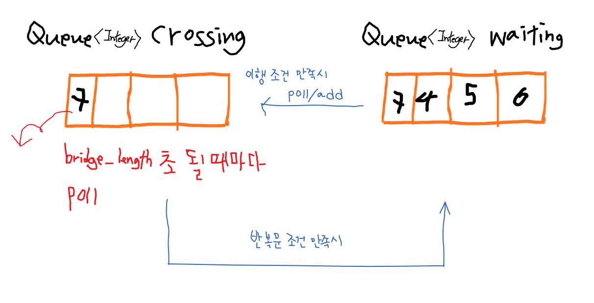

# 프로그래머스 스택/큐 문제 
- 다리를 지나는 트럭
    - https://programmers.co.kr/learn/courses/30/lessons/42583

## 다리를 지나는 트럭
### 내가 고안한 방법
 <br> 
 truck_weights를 차례대로 이행시키 위해서는 배열의 반복문을 사용해도 되지만 **인덱스 변경의 번거로움**, **건너지 않은 트럭개수 확인**을 위해 Queue를 사용했다. 변수에 대한 설명과 구현 순서는 아래와 같다.
#### 변수 설명 
 - waiting_truck: 건너기전 큐
 - crossing_truck: 건너는중 큐
 - sec: 시간 확인을 위한 초
 - all_weight: 건너는중인 트럭들의 무게 총합
#### 구현 순서
 1. 건너기전/건너는중 큐 생성하고, truck_weights 값을 건너기전 큐에 모두 삽입
 2. while() 반복문 수행 - 건너기전 큐에 요소가 존재하거나 건너는중 큐에 요소가 존재하면 수행한다.
    1. 수행 시작과 동시에 sec가 카운트되고 반복문 각 수행마다 1초씩 늘어난다. 
    2. 3가지 조건을 만족하면 건너기전 큐에서 요소를 꺼내 건너는중 큐로 옮긴다.
        - 건너기전큐에 요소가 있다
        - 다리무게가 건너는중인 트럭 총합+ 건너려는 트럭 보다 크거나 같다
        - 다리길이>건너는 중인 트럭개수 
    3. 트럭이 다리를 완전히 지나가려면 다리길이 만큼의 시간이 걸린다. 따라서 sec이 bridge_length만큼 흐를 때마다 건너는중 큐에서 요소 하나를 뺀다.


```java
import java.util.*;
class Solution {
    public int solution(int bridge_length, int weight, int[] truck_weights) {
        int sec=0;
        Queue<Integer> waiting_truck = new LinkedList();
        Queue<Integer> crossing_truck = new LinkedList();
        for(int t: truck_weights)   waiting_truck.add(t);
        
        while(!waiting_truck.isEmpty() || !crossing_truck.isEmpty() ){
        	int all_weight = 0;
        	sec++;
            //건너는중인 트럭 무게총합
            for(Iterator<Integer> iter = crossing_truck.iterator();iter.hasNext(); )
            	all_weight += iter.next();
            //아직 안건넌 트럭 있을때/무게비교/길이비교
            if((crossing_truck.isEmpty()) &&(weight>=all_weight+waiting_truck.peek()) && (bridge_length>crossing_truck.size()) ){
            	int e = waiting_truck.poll();
                crossing_truck.add(e);
            }
            //트럭하나 건너는데 다리 길이만큼 걸림
            if(sec%bridge_length==0)
                crossing_truck.poll(); 
        }
        return sec;
    }
}
```

해당 코드는 첫번째 입출력 solution(2,10,{7,4,5,6})에만 원하는 결과를 얻었다. 어떤 부분에서 잘못 되었는지 논리의 오류를 추측해보자.
1. 트럭이 다리를 완전히 지나는 조건, 즉 crossing_truck 요소가 poll 되는 조건이 부실하다. 시간에 의한 조건은 시간 절대적이기 때문에 해당 요소가 완전히 건넜다는 판단에 불충분하다. crossing_truck에 들어온 요소가 조건에 포함되어야 한다. 지나는중인 트럭들의 상태를 표시하는 정보가 필요할것같다.
2. 지나기전 큐에서 지나는중 큐로 옮기는 코드와 지나는중 큐에서 제거되는 코드 순서가 잘못되었다. 반복문 수행시 지나는중 큐에서 뺄 요소를 먼저 뺀 후에 지나기전 큐에서 지나는중  큐로 트럭을 옮기는게 올바른 순서이다. 
3. crossing_truck에서 요소 하나를 제거하고 나면 지나는중인 트럭 무게 총합도 변경되어야 한다.

위의 오류 요인들을 해결 할 수 있는 다른 구현 방식 제안한다.

### 해결 예제
- truck의 weight뿐만 아니라 position 정보를 알기위해 Truck클래스를 작성한다.

#### 유의할 점
- Queue 선언시 new LinkedList 객체 삽입
- 파라미터로 받은 배열 길이 만큼 객체 생성하기 위해 **반복문 for 사용**
- 완전 지나간 트럭을 처리하기 위해 레퍼런스 **Truck doneTruck 선언**
- 큐에서 요소 제거 시에 레퍼런스를 사용하는게 좋다. LinkedList의 구조 때문인데 for문에서 큐에서 제거된 애를 참조해서 next() 를 수행하기 때문이다.

### 구현 배경 지식  
- 입력한 순서대로 다른 자료구조로 옮기고, 그 자료구조도 입력한 순서랑 동일하게 차례대로 요소를 하나씩 제거해야 했기 때문에 Queue를 사용한다는 것을 알고 있어야 했다.
- Queue를 제네릭으로 구현 할 수 있어야 한다.
- Queue의 기본 연산 add, peek, poll 사용 방법과 반환 타입을 알고 있어야 한다.
- 문제에 적합한 클래스를 만들고 객체를 이용해 자료를 저장하고 연산 할 수 있어야 한다.
    - Truck에 대한 정보 weight, position이 필요했고 Truck을 차례대로 큐에 입력해야 하기 때문에 클래스로 만들었다.

```java
import java.util.*;
 
public class Solution {
    public int solution(int bridge_length, int weight, int[] truck_weights) {
        int sec=0;
        Queue<Truck> waiting_truck = new LinkedList<>();
        Queue<Truck> crossing_truck = new LinkedList<>();
       
        for(int t : truck_weights) {
        	Truck truck = new Truck();
        	truck.position = 0;
        	truck.weight = t;
        	waiting_truck.add(truck);
        }
        
        while(!waiting_truck.isEmpty() || !crossing_truck.isEmpty()) {
        	sec++;
        	Truck doneTruck = null;
        	int all_weight = 0;
        	for(Truck truck : crossing_truck) {
        		all_weight += truck.weight;
        		truck.position++;
        		if(truck.position>bridge_length) 
        			doneTruck = truck;
        	}
        	
        	if(doneTruck!=null) {
    			crossing_truck.remove(doneTruck);
    			all_weight -= doneTruck.weight;
    		}
        	
        	if(!waiting_truck.isEmpty()) { //아직 안건넌 애들이 남아있을때
        		Truck truck = waiting_truck.peek();
        		if(all_weight+truck.weight<=weight && crossing_truck.size()<bridge_length) {
        			waiting_truck.remove(truck);
        			crossing_truck.add(truck);
        			truck.position++;
                    all_weight +=truck.weight;
        		}
        	}
        }
    
        return sec;
    }
 
    private class Truck {
        int weight;
        int position;
    }
}
```


---
아래의 사이트를 참고해 작성된 글입니다.
- https://stroot.tistory.com/123
- https://mainia.tistory.com/2675
- https://myeonguni.tistory.com/1015
- https://m.blog.naver.com/PostView.nhn?blogId=pjok1122&logNo=221504688603&categoryNo=29&proxyReferer=https%3A%2F%2Fwww.google.com%2F
- https://qortn.tistory.com/225
- http://tcpschool.com/java/java_collectionFramework_stackQueue
- [LinkedList SE8 DOCS](https://docs.oracle.com/javase/8/docs/api/java/util/LinkedList.html)