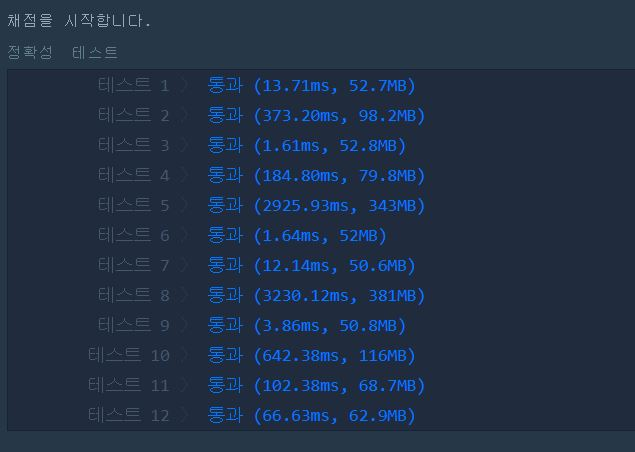

# 프로그래머스 완전탐색 문제
- 소수 찾기
    - https://programmers.co.kr/learn/courses/30/lessons/42839

## 풀이 방법
### 문제와 주어진 조건 이해하기
- 입력데이터는 숫자로 이루어진 문자열, 종이조각이다
- 종이를 찢어 한자리 숫자로 만든 후 다시 조합했을때 몇개의 소수를 만들 수 있는지 세어라.
- 011, 11는 같은 숫자이다.

### 문제 접근 방법
- 완전탐색의 정의를 모르는 상황에서 풀었다. 
- 구현은 복잡하나 문제에 접근하는 방법은 단순하다.
1. 주어진 문자열을 모두 쪼개서 배열 오름차순 저장한다.
2. 만들 수 있는 최대값,최소값을 찾는다.
3. 최소값 부터 최대값 까지 순회하며 소수를 모두 구해 배열리스트에 저장한다.
4. 구한 소수를 순회하며 조건에 맞는 값만 count 한다.
    - 소수를 문자열로 모두 쪼개 (값, 개수)쌍으로 hashMap에 저장한다.
    - 주어진 문자열 또한 같은 방식으로 hashMap에 저장했다. (소수 순회 전에 수행)
    - 조건1: 소수의 엔트리 개수 < 주어진 문자열의 엔트리 개수
    - 조건2: 소수 hashMap key의 value값 <= 주어진 문자열 hashMap key의 value값

### 구현 배경 지식
- HashMap 구현 및 사용 
- int와 String을 변환하는 메서드 Integer.parseInt, String.valueOf
- ArrayList 구현 및 사용
- 소수 정의와 특징 
- 소수 구하는 방법을 코드로 구현

### 접근 방법을 적용한 코드

```java
import java.util.*;
class Solution {
    public int solution(String numbers) {
        String[] split_numbers = numbers.split(""); 
        int[] nums = new int[split_numbers.length];
        for(int i=0 ; i<nums.length ; i++)
            nums[i] = Integer.parseInt(split_numbers[i]);
        Arrays.sort(nums);
        StringBuffer sb = new StringBuffer();
        for(int i=nums.length-1 ; i>=0 ; i--)
            sb.append(nums[i]);
        int min = nums[0];
        int max = Integer.parseInt(sb.toString());
        List<Integer> arr_prime = new ArrayList<>();
        
        for(int i=min ; i<=max ; i++){ //소수 찾아서 넣기
            boolean prime_check=true;
            for(int j=2 ; j*j<=i ; j++){
              if(i%j==0 ){
                  prime_check=false;
                  break;
              }
          }
            if(prime_check && i!=1 && i!=0)  
                arr_prime.add(i); 
        }
        HashMap<String,Integer> hm_nums = new HashMap<>();
        for(String n : split_numbers){
            hm_nums.put(n,hm_nums.getOrDefault(n,0)+1);
        }
        
        int answer=0;
        for(int i=0 ; i<arr_prime.size() ; i++){
            int p = arr_prime.get(i);
            String p_str = String.valueOf(p);
            String[] p_arr = p_str.split("");
            HashMap<String,Integer> hm_p = new HashMap<>();

            for(String str : p_arr)
                hm_p.put(str,hm_p.getOrDefault(str,0)+1);
            boolean isPrime = true;
            if(hm_p.size()<=hm_nums.size()){
                for(String key: hm_p.keySet()){
                    if( hm_nums.get(key)==null || hm_p.get(key) > hm_nums.get(key))
                        isPrime=false;
                }
                if(isPrime)
                    answer++;
            }
        }
        
        return answer;
    }
}
```

### 리팩터링한 코드
- 이해하기 쉽도록 순서 재배치 및 주석 포함
- 소수를 최소값부터 구하면 0,1이 들어가고 아래 if 조건문에서 걸러주어야 하므로 번거로움을 피하기 위해 **min이상 max이하** 조건에서 **2이상 max이하** 조건으로 변경했다.

```java
import java.util.*;
class Solution {
    public int solution(String numbers) {
        
        String[] split_numbers = numbers.split(""); 
        Arrays.sort(split_numbers); 
        StringBuffer sb = new StringBuffer();
        for(int i=split_numbers.length-1 ; i>=0 ; i--)
            sb.append(split_numbers[i]);
        int max = Integer.parseInt(sb.toString());
        
        int[] nums = new int[split_numbers.length];
        for(int i=0 ; i<nums.length ; i++)
            nums[i] = Integer.parseInt(split_numbers[i]);
        List<Integer> arr_prime = new ArrayList<>();
        
        //최대값 이하에서 소수 구하기 
        for(int i=2 ; i<=max; i++){ //소수 찾아서 리스트에 넣기
            boolean prime_check=true;
            for(int j=2 ; j*j<=i ; j++){
              if(i%j==0 ){
                  prime_check=false;
                  break;
              }
          }
            if(prime_check)  
                arr_prime.add(i); 
        }
        
        //주어진 문자열을 해시맵에 저장
        HashMap<String,Integer> hm_nums = new HashMap<>();
        for(String n : split_numbers)
            hm_nums.put(n,hm_nums.getOrDefault(n,0)+1);
        
        
        //소수리스트에서 요소 하나 꺼내 주어진 문자열과 비교검사
        int answer=0;
        for(int i=0 ; i<arr_prime.size() ; i++){
            int p = arr_prime.get(i);
            String p_str = String.valueOf(p);
            String[] p_arr = p_str.split("");
            HashMap<String,Integer> hm_p = new HashMap<>();

            for(String str : p_arr)
                hm_p.put(str,hm_p.getOrDefault(str,0)+1);
            boolean isPrime = true;
            
            // 1. 길이 안맞으면 거르기 2. 소수에 있는 숫자가 주어진 문자열에 포함안되면 거르기
            if(hm_p.size()>hm_nums.size()) continue;
            for(String key: hm_p.keySet()){
                if( hm_nums.get(key)==null || hm_p.get(key) > hm_nums.get(key))
                    isPrime=false;
                }
            if(isPrime)
                answer++;
        }
        
        return answer;
    }
}
```

### 해결하지 못한 이유

- 테스트는 통과했으나 결과가 매우 비효율적이다.
- 테스트 통과가 항상 '답'은 아니다. 구현력에서 우위를 결정하는건 **효율성**이다. 해당 풀이는 효율성에서 실패했다.
- 향후 효율성 좋은 코드를 참고해 수정하기로 한다.


<!-- ### 문제를 해결한 코드

### 문제를 해결한 방법 -->

---
아래의 사이트를 참고하기
- https://github.com/TheCopiens/algorithm-study/blob/master/source/ohhako/200207_string4.md
- [나랑 비슷하게 푸신 분](https://taesan94.tistory.com/41)