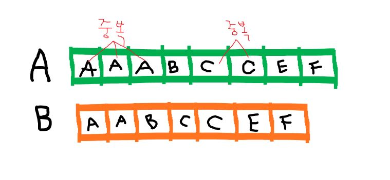
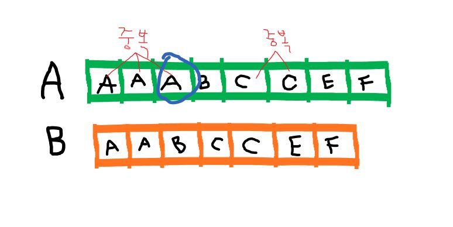

# 프로그래머스 해시 문제 
- 완주하지 못한 선수
    - https://programmers.co.kr/learn/courses/30/lessons/42576
- 위장
    - https://programmers.co.kr/learn/courses/30/lessons/42578?language=java

## 완주하지 못한 선수
### 내가 사용한 방법
모든 participant를 hash에 넣어 completion으로 검색했을때 안나오는 문자열을 반환하는 아주 단순한 알고리즘으로 생각했다. 실제 코드로 구현해보니 **두가지 문제**가 생겼다.
1. hash에 participant를 어떻게 넣을 것인가? (key 중복문제)
    - 문자열을 검색해서 찾으려면 hash를 써야하는데 key엔 뭘넣고 value엔 뭘 넣어야 할지 몰라서 key,value에 같은 문자열을 넣으려고 했다. 그런데 participant는 중복되어 있으므로 key로 쓰지 못한다. **key중복의 문제점**이 발생했다. completion을 key로 사용해 value 값을 찾아 지우려면 participant를 key로 입력해야 하니 혼란이 왔다. 우회 방법으로 completion을 hash에 넣으려고 하니 **순환의 문제점**이 발생했다.
2. 어떤 객체를 순환할 것인가?
    - hash가 partici나 complet를 포함하면 hash를 지우는 방법을 쓰려니 요소가 하나 더 많은 partici를 넣어야 했다. 하지만 위와 같은 이유로 **중복의 문제점** 이 발생했다.

해시를 사용하려면 **중복을 어떻게 다루어야 하는지**를 알고 있어야 했다. 물론 해시를 사용하지 않는 방법도 있으나 그건 아래 예제로 확인하자.

### 중복을 포함한 해시 문제 해결하기

중복 문자열을 포함한 A 배열을 **해시**에 넣고 그 자료구조에서 B배열에 해당하지 않는 요소를 찾는 문제를 예시로 들어보자.<br> 찾고있는 요소가 아니면 모두 지워버림으로서 찾는 요소를 마지막으로 남겨두는 방법보다는, 지우지 않고도 요소를 찾는 방법을 고안한다.<br> 단지 요소가 **중복** 되었다는 **표시**가 필요하다. 몇번 중복되었는지 숫자 표시는 key가 아닌 <code>value</code>를 통해 이루어진다. 이유는 value값을 쓰려면 get함수를 써야하는데 key가 get의 인자이므로 **온전해야** 한다. 따라서 중복의 표시는 value에서 이루어진다. 결국 필요한건 과정을 요약하자면 이렇다.
    - 새로운 key이면 그대로 put(key,value)
    - 중복된 key라면 put(key,hash.get(key)+1)

### 해결 예제
#### 첫번째 방법) 중복을 처리함으로서 해시를 이용한 요소찾기
### getOrDefault(),keySet() 메서드에 유의

 **getOrDefault(Object key,int defaultValue)**: 해시에서 key로 요소를 찾아 반환하고 없으면 기본값을 반환한다.
 
```java
import java.uitl.*;
class Solution{
    public String solution(String[] participant, String[] completion) {
        String answer ="";
        HashMap<String,Integer> hm = new HashMap<>();
        for(String p:participant) hm.put(p,hm.getOrDefault(p,0)+1);
        for(String c:completion) hm.put(c,hm.get(c)-1);

        for(String key:hm.keySet()){
            if(hm.get(key)!=0) answer=key;
        }
        return answer;
    }
}
```


#### 두번째 방법) 배열크기 차이가 1임을 이용한 비교연산

이 풀이 방법은 매우 간단하고 효율적이며 코드 또한 명확하다. 그림으로 이해하자면 요소가 하나 더 많은 participant가 A배열에 해당되며 completion은 B배열에 해당한다. Arrays.sort() 메서드를 이용해 배열을 정렬시킨 후 for문에서 차례대로 비교하면 두 배열이 가리키는 요소가 달라지는 순간이 온다. <br>
return하는 요소가 participant[i]인 점을 주의하도록 한다.
### Arrays.sort(Object[] a) 메서드에 유의
```java
import java.uitl.*;
class Solution{
    public String solution(String[] participant, String[] completion) {
        Arrays.sort(participant);
        Arrays.sort(completion);
        int i=0;
        for(i=0 ; i	< competion ; i++){
            if(participant[i].equals(completion[i]))
                return participant[i];
        }
        return participant[i];
    }
}
```

**Arrays.sort(Object[] a)** : 오름차순 정렬
**Arrays.sort(Object[] a,Collections.reverseOrder())** : 내림차순 정렬


## 위장
### 내가 사용한 방법
이 문제를 풀기 위해서는 문제를 잘 읽고 어떤 지식과 처리가 필요한지 파악해야 한다.
    - 어떤 요소를 해시의 <code>key</code>와 <code>value</code>로 둘것인가
    - **경우의 수**와 관련된 지식인것 같다 따라서 숫자를 세야한다
    - **이중배열**의 기본 구조와 표현을 이해하고 있어야 한다.
    - **반복적**으로 나온다는건 그 반복 요소를 하나의 <code>key</code>로 삼아서 <code>value</code>에 횟수를 카운트 할 수 있음을 시사한다

위에서 공부했던 경험으로 우리는 key,value를 설정할 수 있다. key를 결정짓는건 반복적으로 나오는 요소인 '착장종류'이다. 위에서 사용한 **getOrDefault()** 메서드를 이용해 같은 종류의 의상이 몇개인지 셀 수 있다. <br>
- hm.put(clothes[i][1],hm.getOrDefault(clothes[i][1],0)+1);
    - 테스트 케이스의 입력값과 문제에서 주어진 2차원 배열을 보면 각 행은 "의상이름,의상종류"로 표시되어 있다. 따라서 clothes[i][1]는 옷의 종류를 의미하고 해당 요소를 해시의 key로 넘긴다. value는 동일한 종류의 옷이 hash에 이미 존재하면 그 value를 그대로 가져온다. 존재하지 않는 값이면 0을 반환한다. 그리고 존재하든 존재하지 않든 종류의 개수를 세야하기 때문에 +1 을 한다. 
각 종류마다 알고있는 개수를 어떻게 활용해야 문제에서 요구하는 개수를 셀 수 있을까?<br><br>

예시로 이해를 돕도록 한다. 배 a, b, c/ 귤 e, f/사과 g, h, i 가 있다고 가정하자. 여기에 각 과일을 선택하지 않는 경우 하나를 각 과일에 포함시킨다.<br>
배 a, b, c, 0 <br>
귤 e, f, 0 <br>
사과 g, h, i, 0 <br> 
주어진 문제의 방법대로라면 (배 + 1) * (귤 + 1) * (사과 + 1) -1 = (4 * 3 * 4) -1 이 총 가지수가 된다. 아무것도 선택하지 않을 (0,0,0) 경우를 제외시키기 위해 -1를 해주었다. 동일한 방식으로 answer의 답을 구할 수 있다. <br>
지금까지 설명한 풀이를 코드로 반영했다. 

```java
import java.util.*;
class Solution {
    public int solution(String[][] clothes) {
        int answer=1;
        HashMap<String,Integer> hm = new HashMap<>();
        for(int i=0 ; i<clothes.length ; i++)
            hm.put(clothes[i][1],hm.getOrDefault(clothes[i][1],0)+1);
        for(String key:hm.keySet())
            answer = answer*(hm.get(key)+1);
        answer-=1;
        return answer;
    }
}
```


---
아래의 사이트를 참고해 작성된 글입니다.
- https://suhak.tistory.com/2
- https://tallman.tistory.com/7