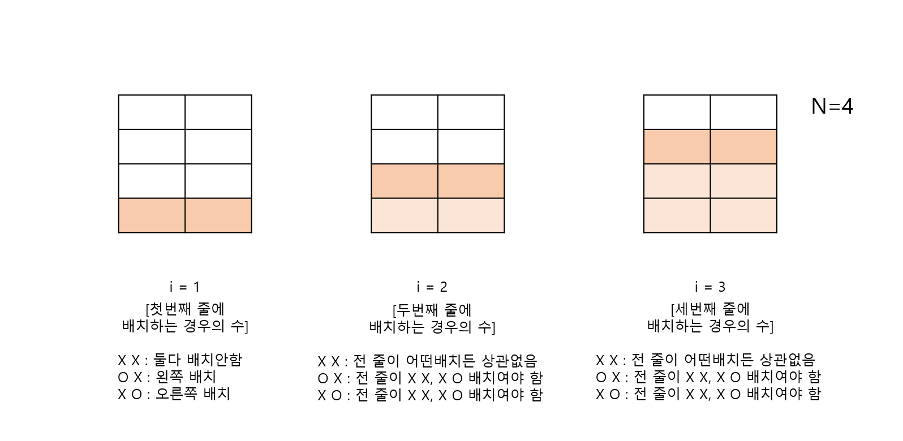

# 백준 동적프로그래밍(DP) 문제
- 동물원(1309)
    - https://www.acmicpc.net/problem/1309

## 풀이 방법
### 문제와 주어진 조건 이해하기
- 사자를 우리에 배치하는 경우의 수를 구해 9901로 나눈 수를 출력하라.
- 우리의 크기 가로는 무조건 두칸, 세로는 입력값 N으로 주어진다.
- 사자는 옆, 위아래로 붙여놓지 못한다. 
- 사자 한마리도 배치 안하는것도 경우의 수에 포함된다.

### 문제 접근 방법
- 겹쳐지지 않기위해 최대로 배치 가능한 사자 숫자가 N마리 이다.
- 0마리, 1마리, ... N마리 뽑을때 방식이 각각 다르다.
- 이 문제는 DP타입이니 전체의 과정을 작은일 단위로 쪼개 반복해야한다.

### 해결하지 못한 이유
- 그런데 어떤 과정을 **일**로 설정해야할지?
- 어떤 데이터를 기록해놓아야 할지?

### 문제를 해결한 방법

- 현재 줄에 사자를 배치하는 방법은 세가지 이다.  
    - (X,X)(O,X)(X,O)
- 다음 배치하는 줄도 마찬가지로 세가지 이다. 
- 그런데 다음 배치는 현재 배치의 영향을 받는다.(사진 참조)
    - 즉 현재 배치는 과거의 배치로부터 영향받는다.
    - 현재 (X,X)로 배치하는 경우의 수는 전 줄이 (X,X)(O,X)(X,O) 로 배치될 경우의 수와 같다.
    - 현재 (O,X)로 배치하는 경우의 수는 전 줄이 (X,X),(X,O)이어야 하므로 (X,X)인 경우의 수, (X,O)인 경우의 수의 합과 같다.
    - 현재 (X,O)로 배치하는 경우의 수는 전 줄이 (X,X),(O,X)이어야 하므로 (X,X)인 경우의 수, (O,X)인 경우의 수의 합과 같다.
- 따라서 하나의 **일**은 현재의 줄을 배치하는 경우의 수 이며, 현재 줄을 배치하는 경우의 수는 세가지 세부 방법으로 나뉜다. 
- **현재 줄 배치, 세가지로 나뉘는 세부 방법, 과거의 배치로부터 영향** 을 해결해야 한다. 
- 이 흐름을 토대로 점화식을 구성 할 수 있다.
```
dp[i][0] = (dp[i-1][0] + dp[i-1][1]+ dp[i-1][2])%9901; // (X,X) 배치 경우의 수
dp[i][1] = (dp[i-1][0] + dp[i-1][2])%9901; //(O,X) 배치 경우의 수
dp[i][2] = (dp[i-1][0] + dp[i-1][1])%9901; //(X,O) 배치 경우의 수
```
- 세가지 방법으로 나누어 경우의 수를 자료에 저장해야 한다. 
- 9901로 나눈 몫을 저장한 이유
    - 최종 답은 **모든 경우의 수를 9901로 나눈 몫** 이다.
    - 문제에서 주어진 N의 최대값은 10만이다. 
    - 따라서 반복문을 거칠수록 값이 커지므로 과정에서도 9901로 나누는 연산을 추가했다.

- 이 풀이에서 내가 주목한 특징
    - **반복되는 일**이 무엇인지 알려면 패턴을 찾아야하는데 이 문제에선 패턴을 찾으려면 처음부터 차근차근 사자를 우리에 배치해보아야 할 것 같다.
    - 배열로 사자의 배치 형태를 직접적으로 나타내지 않았다는 것
    - dp문제를 풀다보면 문제의 상황을 자료구조로 직접 나타내기보단, 경우의 수나 계산 값 정도를 배열에 저장하는 경우가 많은 것 같다.

### 문제를 해결한 코드
```java
    public static void solution() {
		Scanner sc = new Scanner(System.in);
		int n = sc.nextInt();
		long[][] dp = new long[n+1][3];
		dp[1][0]=1;
		dp[1][1]=1;
		dp[1][2]=1;
		
		for(int i=2 ; i<=n ; i++) {
			dp[i][0] = (dp[i-1][0] + dp[i-1][1]+ dp[i-1][2])%9901; //왼,오 아무것도 넣지않는 경우의 수
			dp[i][1] = (dp[i-1][0] + dp[i-1][2])%9901; //왼쪽에 배치할 경우의 수
			dp[i][2] = (dp[i-1][0] + dp[i-1][1])%9901;
			
		}
		System.out.println((dp[n][0]+dp[n][1]+dp[n][2])%9901);
	}
```


---
아래의 사이트를 참고해 작성된 글입니다.
- https://mygumi.tistory.com/128
- http://wookje.dance/2017/08/05/boj-1309-%EB%8F%99%EB%AC%BC%EC%9B%90/
- https://github.com/hotehrud/acmicpc/blob/master/algorithm/dp/1309.java