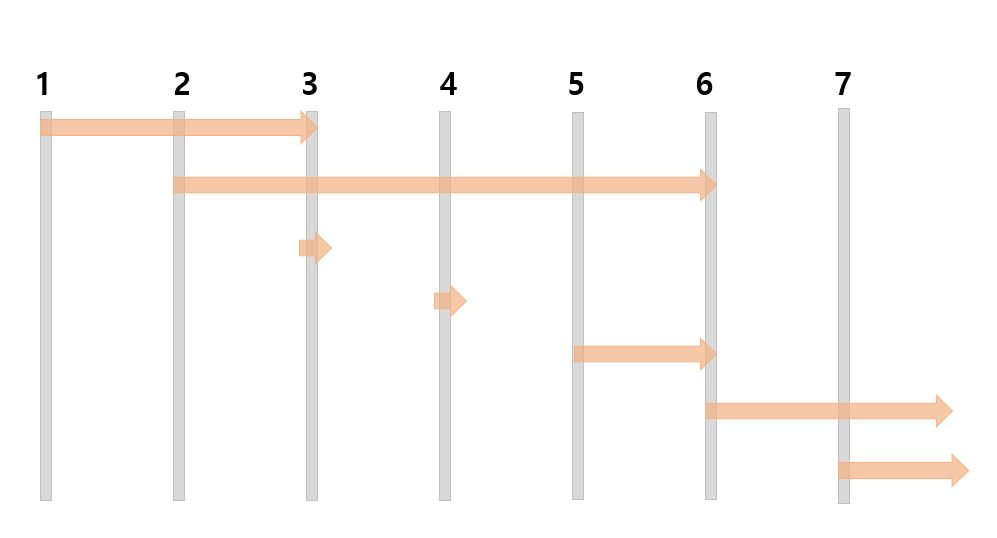

# 백준 DP 문제

- 퇴사
  - https://www.acmicpc.net/problem/14501

## 풀이 방법

### 문제 이해하기

- 입력값: 마지막 상담일(N), N개의 상담기간(T)과 금액(P)

### 문제 접근 방법

- 하나의 규칙을 세운다.
  - 진료를 제일 많이하는 경우가 가장 얻는 비용이 높다. (X)
  - i일에 가능한 최대 비용을 구하면 마지막에 N일의 최대 비용을 구할 수 있다. (접근가능)
  - 진료를 최대로 할 수 있는 조합 중 가장 비용이 큰 것을 선택한다. (복잡)
- 각 상담이 얼마인지, 언제 시작해 언제 끝나는지 정보가 있다.

### 해결하지 못한 이유

- `i부터 N까지 해당 날짜의 최대비용 구하기`의 규칙 세우기 까지는 접근했다.
- 문제는 날짜 겹치는것 해결도 해야하고 어떤 선택이 최대일지 비교도 해야하고.
- 결국 90분을 고민만 하다가 보냈다.

### 문제를 해결한 방법



- 규칙을 세우는데 이용할 수 있는 정보: 각 작업의 시작일,종료일, 금액
- 규칙을 세우는데 이용한 관계

  1. dp[ i ]는 i일부터 마지막 날짜(n)까지 일하여 얻은 최대 비용이다.
  2. 1일부터 마지막날 까지 일해 번 총액과 2일부터 일해서 번 총액을 비교해야 한다.

### 문제를 해결한 코드

```java
import java.io.InputStreamReader;
import java.io.BufferedReader;
import java.io.IOException;
import java.lang.Math;
public class Main{
    public static void solution(int n,int[] t,int[] p){
        int[] dp = new int[n+2]; // dp[i]= i일~마지막날까지 얻은 최대비용

        for(int i=n ; i>0 ; i--){
            int end_day = i+t[i]; //끝난 다음날
            if(end_day<=n+1){
                dp[i] = Math.max(p[i]+dp[end_day],dp[i+1]);
            }else{
                dp[i] = dp[i+1];
            }
        }
        System.out.println(dp[1]);
    }
    public static void main(String[] args) throws IOException{
        BufferedReader br = new BufferedReader(new InputStreamReader(System.in));
        int n = Integer.parseInt(br.readLine());
        int[] t = new int[n+2];
        int[] p = new int[n+2];
        for(int i=1 ; i<=n ; i++){
            String[] cmd = br.readLine().split(" ");
            t[i] = Integer.parseInt(cmd[0]);
            p[i] = Integer.parseInt(cmd[1]);
        }
        solution(n,t,p);
    }
}
```
