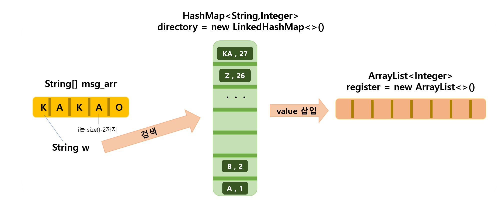
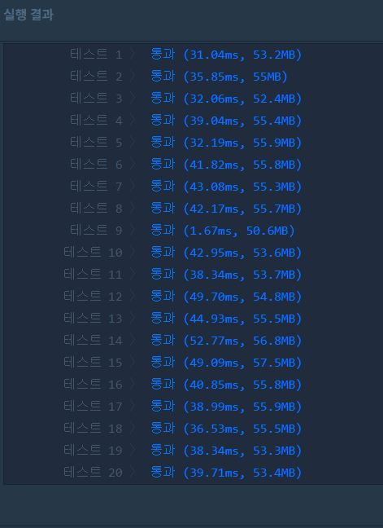

# 프로그래머스 2018 KAKAO BLIND RECRUITMENT 문제
- 압축
    - https://programmers.co.kr/learn/courses/30/lessons/17684

## 풀이 방법
### 문제와 주어진 조건 이해하기
- 입력받은 문자열을 차례대로 사전을 이용해 조사하려고 한다. 
- 찾는 문자열이 사전에 있으면 출력하고 없으면 사전에 새로 추가한다.
- 이때 찾는 문자열은 사전에 있는것에 한하여 문자열 길이를 최대로 만들어야 한다.

### 문제 접근 방법
 
- 문자열의 색인은 HashMap에서 조회한다.
- 출력하려는 숫자는 ArrayList에 삽입한다.
- 문자열을 변수 w에 하나씩 붙이면서 조사한다.

### 구현 배경 지식
- HashMap

### 접근 방법을 적용한 코드
```java
import java.util.*;
class Solution {
  public int[] solution(String msg) {
      
      HashMap<String,Integer> directory = new LinkedHashMap<>();
      String[] alphabet = {"A","B","C","D","E","F","G","H","I","J","K","L","M","N","O","P","Q","R","S","T","U","V","W","X","Y","Z"};
      for(int i=0 ; i<alphabet.length ; i++){
          directory.put(alphabet[i],i+1);
      }
      
      String[] msg_arr = msg.split("");
      ArrayList<Integer> register = new ArrayList<>();
      String w = "";
      
      for(int i=0 ; i < msg_arr.length-1 ;i++){ 
          w += msg_arr[i];
          if(directory.containsKey(w+msg_arr[i+1])){
              if(i==msg_arr.length-2)
                register.add(directory.get(w+msg_arr[i+1]));
          }else{
              register.add(directory.get(w));
              directory.put(w+msg_arr[i+1],directory.size()+1);
              w = "";
             if(i==msg_arr.length-2){
                 register.add(directory.get(msg_arr[i+1]));
              }
          }
      }
      
      int[] answer = new int[register.size()];
      for(int i=0 ; i<register.size() ; i++)
          answer[i] = register.get(i);
      return answer;
  }
}
```
```
테스트 9 〉	실패 (3.01ms, 50.8MB)
```
### 해결하지 못한 이유
- 주어진 문자가 하나일때는 i-2가 나올 수 없으므로 예외처리가 필요하다.

### 문제를 해결한 코드
```java
import java.util.*;
class Solution {
  public int[] solution(String msg) {
      
      HashMap<String,Integer> directory = new LinkedHashMap<>();
      String[] alphabet = {"A","B","C","D","E","F","G","H","I","J","K","L","M","N","O","P","Q","R","S","T","U","V","W","X","Y","Z"};
      for(int i=0 ; i<alphabet.length ; i++){
          directory.put(alphabet[i],i+1);
      }
      
      String[] msg_arr = msg.split("");
      ArrayList<Integer> register = new ArrayList<>();
      String w = ""; 
      
      if(msg_arr.length==1){
          int[] answer= {directory.get(msg)};
          return answer;
      }
      
      for(int i=0 ; i < msg_arr.length-1 ;i++){ 
          w += msg_arr[i];
          if(directory.containsKey(w+msg_arr[i+1])){
              if(i==msg_arr.length-2)
                register.add(directory.get(w+msg_arr[i+1]));
          }else{
              register.add(directory.get(w));
              directory.put(w+msg_arr[i+1],directory.size()+1);
              w = "";
             if(i==msg_arr.length-2){
                 register.add(directory.get(msg_arr[i+1]));
              }
          }
      }
      
      int[] answer = new int[register.size()];
      for(int i=0 ; i<register.size() ; i++)
          answer[i] = register.get(i);
      return answer;
  }
}
```
 


### 코드 리팩터링
- String을 StringBuffer로 변경한 결과 시간 10ms 가량 감축
```java
import java.util.*;
class Solution {
  public int[] solution(String msg) {
      
      HashMap<String,Integer> directory = new LinkedHashMap<>();
      String[] alphabet = {"A","B","C","D","E","F","G","H","I","J","K","L","M","N","O","P","Q","R","S","T","U","V","W","X","Y","Z"};
      for(int i=0 ; i<alphabet.length ; i++){
          directory.put(alphabet[i],i+1);
      }
      
      String[] msg_arr = msg.split("");
      ArrayList<Integer> register = new ArrayList<>();
      StringBuffer w = new StringBuffer();
      
      if(msg_arr.length==1){
          int[] answer= {directory.get(msg)};
          return answer;
      }
      
      for(int i=0 ; i < msg_arr.length-1 ;i++){ 
          w.append(msg_arr[i]);
          if(directory.containsKey(w.toString()+msg_arr[i+1])){
              if(i==msg_arr.length-2)
                 register.add(directory.get(w.toString()+msg_arr[i+1]));
          }else{
              register.add(directory.get(w.toString()));
              w.append(msg_arr[i+1]);
              directory.put(w.toString(),directory.size()+1);
              w.setLength(0);
              if(i==msg_arr.length-2){
                 register.add(directory.get(msg_arr[i+1]));
              }
          }
      }
      
      int[] answer = new int[register.size()];
      for(int i=0 ; i<register.size() ; i++)
          answer[i] = register.get(i);
      return answer;
  }
}
```

